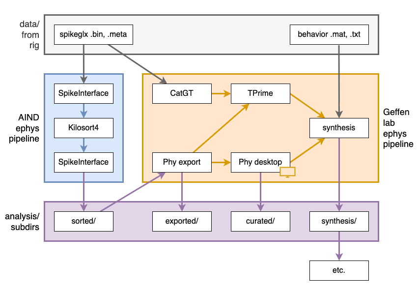

# geffenlab-ephys-pipeline

This repo contains a [Nextflow](https://www.nextflow.io/) pipeline for processing Geffen lab ephys data.

For each datset:
 - First we want to run the [AIND ephys pipeline](https://github.com/AllenNeuralDynamics/aind-ephys-pipeline).  This will do spike sorting and automated curation based on quality metrics.
 - Then we want to run this Geffen lab ephys pipeline.  This will convert sorting outputs to Phy format, optionally invoke Phy for intearactive curation, then save outputs from some of the lab's [population-analysis](https://github.com/jcollina/population-analysis) code.

# Getting started on cortex

For docs on getting started with processing on the cortex server, please see:
 - [cortex-user-setup.md](./aind-ephys-pipeline/cortex-user-setup.md)
 - [corted-first-run.md](./aind-ephys-pipeline/corted-first-run.md)

# Overview

Here's an overview of the pipeline.

[editable diagram at draw.io](https://drive.google.com/file/d/1dpmN89oHnOK7tfIegiJ8pkNQINFG5Lw_/view?usp=sharing)

The pipeline starts with raw, original SpikeGLX and behavior data from a rig.  The AIND ephys pipeline does spike sorting with Kilosort4 and automated curation based on quality metrics with SpikeInterface.  The Geffen lab ephys pipeline converts sorting results to the Phy format and allows for interactive curation with Phy.  It uses CatGT, TPrime, and custom lab code to align curated sorting results with event and behavior data.  It produces several subdirectories of analysis results, includgin a `synthesis/` subdirectory intended to support further analysis.

# Pipeline steps and Docker images 

All of the steps in the Geffen lab ephys pipeline are all based on [Docker images](https://docs.docker.com/get-started/docker-concepts/the-basics/what-is-an-image/).  Each image contains custom Python code, bundled into a reproducible environment along with the Python runtime and other dependencies.

Each of our Docker images lives in its own repostory, described below.

## geffenlab-ecephys-phy-export

The [geffenlab-ecephys-phy-export](https://github.com/benjamin-heasly/geffenlab-ecephys-phy-export) image has code to convert AIND ephys pipeline results to the Phy format, using [SpikeInterface](https://spikeinterface.readthedocs.io/en/stable/).

It also creates a default `cluster_info.tsv`, which makes it optional to do manual curation via Phy.

## geffenlab-spikeglx-tools

The [geffenlab-spikeglx-tools](https://github.com/benjamin-heasly/geffenlab-spikeglx-tools) image has tools for processing SpikeGLX outputs, like [CatGT](https://billkarsh.github.io/SpikeGLX/#catgt) and [TPrime](https://billkarsh.github.io/SpikeGLX/#tprime).

It has Python wrappers for calling these tools in a more familiar Python style.

## geffenlab-phy-desktop

The [geffenlab-phy-desktop](https://github.com/benjamin-heasly/geffenlab-phy-desktop) image has a [Phy](https://phy.readthedocs.io/en/latest/) installation that we can use for interactive curation.

It can also create a default `cluster_info.tsv`, noninteractively, making interactive curation optional.

## geffenlab-synthesis

The [geffenlab-synthesis](https://github.com/benjamin-heasly/geffenlab-synthesis) image incorporates the lab's [population-analysis](https://github.com/jcollina/population-analysis) code for aligning and combining data into dataframes, and plotting session summary figures.
