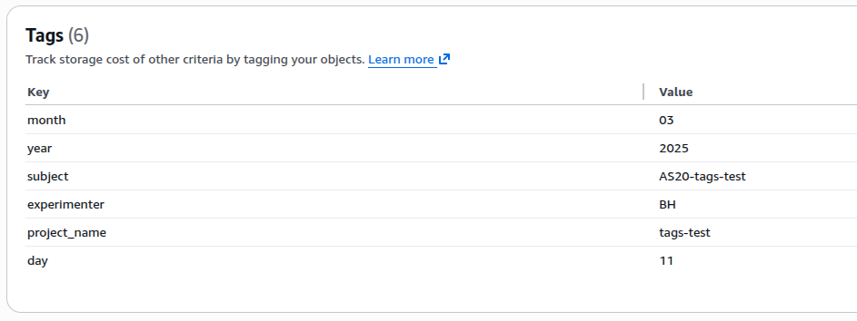

# Archiving Data to S3

This doc should help you archive session raw data from a cortex to the lab's S3 bucket.

First, you'll need to do the one-time [cortex user setup](./cortex-user-setup.md) for your cortex user account and local lab machine.

## Archive raw data to S3

This repo has a Python script [archive.py](../scripts/archive_data.py) that should help archiving data from cortex to the lab's S3 bucket.

Connect to cortex via remote desktop, open a terminal window, and run this script:

```
cd /vol/cortex/cd4/geffenlab/nextflow/geffenlab-ephys-pipeline/scripts
conda activate geffen-pipelines

python archive_data.py --delete
```

The `--delete` flag means files data will be deleted from cortex once it's succesfully archived to S3.  If you don't supply this flag, the files will be kept on cortex even after archiving.

You can also use the `--dry-run` flag to see what the script would do, without committing data to S3 or deleting anything.

The script will prompt you for the experimenter initials, subject id, and session date(s) that you want to archive.
You can provide an optional qualifier to filter which files will be archived.  Finally the script will prompt you for a project name, for tagging the data objects in S3.

For example:

```
$ python archive_data.py --delete

2026-03-12 11:26:31,382 [INFO] Archiving files within raw data root: /vol/cortex/cd4/geffenlab/raw_data
Experimenter initials: BH
2026-03-12 11:26:33,557 [INFO] Archiving files for experimenter: BH
Subject ID: AS20-tags-test
2026-03-12 11:26:52,581 [INFO] Archiving files for subject id: AS20-tags-test
Session date MMDDYYYY (multiple dates may be separated by spaces): 03112025
2026-03-12 11:26:56,887 [INFO] Archiving files for session date(s): ['2025-03-11']
Qualifier like 'training','ap.bin', 'recording1', etc.  Leave blank to upload all: 
2026-03-12 11:26:58,065 [INFO] Archiving all files
Project name (for tag 'project_name' on stored objects): tags-test
2026-03-12 11:27:04,762 [INFO] Adding stored object tag project_name=tags-test.
2026-03-12 11:27:04,762 [INFO] Using S3 bucket: upenn-research.geffen-lab-01.us-east-1
2026-03-12 11:27:04,762 [INFO] Using S3 bucket path prefix: cortex/raw_data
2026-03-12 11:27:04,762 [INFO] Using S3 storage class: DEEP_ARCHIVE
2026-03-12 11:27:04,762 [INFO] Using AWS credentials from: /vol/cortex/cd4/geffenlab/.aws/credentials
2026-03-12 11:27:04,762 [INFO] Using AWS config from: /vol/cortex/cd4/geffenlab/.aws/config
2026-03-12 11:27:04,762 [WARNING] Deleting local files after archiving.
```

Based on the experimenter initials, subject id, session date(s) the script will search the local `raw_data` directory for files to archive.

From all the files found, the script can use the optional qualifier to further restrict which files will be uploaded.  When the qualifier is provided, only files that contain the qualifier in their name will be uploaded.  For example, the qualifier "training" could be used to select "training" files but ignore "testing" files.

Before archiving, the script will show which files it plans to archive to S3, along with several tags, and prompt for your confirmation.

```
2026-03-12 11:27:04,762 [INFO] Looking for session date: 2025-03-11 AKA 03112025
2026-03-12 11:27:04,762 [INFO] Using these tags for this date: {'experimenter': 'BH', 'subject': 'AS20-tags-test', 'year': '2025', 'month': '03', 'day': '11', 'project_name': 'tags-test'}
2026-03-12 11:27:04,762 [INFO] Found 10 files within: /vol/cortex/cd4/geffenlab/raw_data/BH/AS20-tags-test/03112025
2026-03-12 11:27:04,763 [INFO] Planning to archive 10 files within /vol/cortex/cd4/geffenlab/raw_data/BH/AS20-tags-test:
2026-03-12 11:27:04,763 [INFO]   03112025/ecephys/AS20_03112025_trainingSingle6Tone2024_Snk3.1_g0/AS20_03112025_trainingSingle6Tone2024_Snk3.1_g0_t0.nidq.bin
2026-03-12 11:27:04,763 [INFO]   03112025/ecephys/AS20_03112025_trainingSingle6Tone2024_Snk3.1_g0/AS20_03112025_trainingSingle6Tone2024_Snk3.1_g0_t0.nidq.meta
2026-03-12 11:27:04,763 [INFO]   03112025/ecephys/AS20_03112025_trainingSingle6Tone2024_Snk3.1_g0/AS20_03112025_trainingSingle6Tone2024_Snk3.1_g0_imec0/AS20_03112025_trainingSingle6Tone2024_Snk3.1_g0_t0.imec0.ap.meta
2026-03-12 11:27:04,763 [INFO]   03112025/ecephys/AS20_03112025_trainingSingle6Tone2024_Snk3.1_g0/AS20_03112025_trainingSingle6Tone2024_Snk3.1_g0_imec0/AS20_03112025_trainingSingle6Tone2024_Snk3.1_g0_t0.imec0.ap.bin
2026-03-12 11:27:04,763 [INFO]   03112025/ecephys/another_session_test_g0/another_session_test_g0_t0.nidq.meta
2026-03-12 11:27:04,763 [INFO]   03112025/ecephys/another_session_test_g0/another_session_test_g0_t0.nidq.bin
2026-03-12 11:27:04,763 [INFO]   03112025/ecephys/another_session_test_g0/another_session_test_g0_imec0/another_session_test_g0_t0.imec0.ap.meta
2026-03-12 11:27:04,763 [INFO]   03112025/ecephys/another_session_test_g0/another_session_test_g0_imec0/another_session_test_g0_t0.imec0.ap.bin
2026-03-12 11:27:04,763 [INFO]   03112025/behavior/AS20_031125_trainingSingle6Tone2024_0_39.mat
2026-03-12 11:27:04,764 [INFO]   03112025/behavior/AS20_031125_trainingSingle6Tone2024_0_39.txt
Do you want to archive these 10 files?  Type 'yes' to proceed: yes
```

You must type `yes` to proceed.  Otherwise the script will exit before archiving.
If you do type `yes` the script will upload files to S3.:


```
2026-03-12 11:27:14,343 [WARNING] Proceeding to archive files.
2026-03-12 11:27:14,364 [INFO] Found credentials in shared credentials file: /vol/cortex/cd4/geffenlab/.aws/credentials
2026-03-12 11:27:14,453 [INFO] Archiving s3://upenn-research.geffen-lab-01.us-east-1/cortex/raw_data/BH/AS20-tags-test/03112025/ecephys/AS20_03112025_trainingSingle6Tone2024_Snk3.1_g0/AS20_03112025_trainingSingle6Tone2024_Snk3.1_g0_t0.nidq.bin
2026-03-12 11:27:23,890 [INFO] Archiving s3://upenn-research.geffen-lab-01.us-east-1/cortex/raw_data/BH/AS20-tags-test/03112025/ecephys/AS20_03112025_trainingSingle6Tone2024_Snk3.1_g0/AS20_03112025_trainingSingle6Tone2024_Snk3.1_g0_t0.nidq.meta
2026-03-12 11:27:24,058 [INFO] Archiving s3://upenn-research.geffen-lab-01.us-east-1/cortex/raw_data/BH/AS20-tags-test/03112025/ecephys/AS20_03112025_trainingSingle6Tone2024_Snk3.1_g0/AS20_03112025_trainingSingle6Tone2024_Snk3.1_g0_imec0/AS20_03112025_trainingSingle6Tone2024_Snk3.1_g0_t0.imec0.ap.meta
2026-03-12 11:27:24,192 [INFO] Archiving s3://upenn-research.geffen-lab-01.us-east-1/cortex/raw_data/BH/AS20-tags-test/03112025/ecephys/AS20_03112025_trainingSingle6Tone2024_Snk3.1_g0/AS20_03112025_trainingSingle6Tone2024_Snk3.1_g0_imec0/AS20_03112025_trainingSingle6Tone2024_Snk3.1_g0_t0.imec0.ap.bin
2026-03-12 11:27:34,779 [INFO] Archiving s3://upenn-research.geffen-lab-01.us-east-1/cortex/raw_data/BH/AS20-tags-test/03112025/ecephys/another_session_test_g0/another_session_test_g0_t0.nidq.meta
2026-03-12 11:27:34,918 [INFO] Archiving s3://upenn-research.geffen-lab-01.us-east-1/cortex/raw_data/BH/AS20-tags-test/03112025/ecephys/another_session_test_g0/another_session_test_g0_t0.nidq.bin
2026-03-12 11:27:42,501 [INFO] Archiving s3://upenn-research.geffen-lab-01.us-east-1/cortex/raw_data/BH/AS20-tags-test/03112025/ecephys/another_session_test_g0/another_session_test_g0_imec0/another_session_test_g0_t0.imec0.ap.meta
2026-03-12 11:27:42,642 [INFO] Archiving s3://upenn-research.geffen-lab-01.us-east-1/cortex/raw_data/BH/AS20-tags-test/03112025/ecephys/another_session_test_g0/another_session_test_g0_imec0/another_session_test_g0_t0.imec0.ap.bin
2026-03-12 11:27:54,444 [INFO] Archiving s3://upenn-research.geffen-lab-01.us-east-1/cortex/raw_data/BH/AS20-tags-test/03112025/behavior/AS20_031125_trainingSingle6Tone2024_0_39.mat
2026-03-12 11:27:54,556 [INFO] Archiving s3://upenn-research.geffen-lab-01.us-east-1/cortex/raw_data/BH/AS20-tags-test/03112025/behavior/AS20_031125_trainingSingle6Tone2024_0_39.txt
2026-03-12 11:27:54,666 [INFO] Archived 10 files
```

If you provided the `--delete` flag, the script will then delete the archived files from cortex.

```
2026-03-12 11:27:54,666 [WARNING] Proceeding to delete local files.
2026-03-12 11:27:54,666 [INFO] Deleting BH/AS20-tags-test/03112025/ecephys/AS20_03112025_trainingSingle6Tone2024_Snk3.1_g0/AS20_03112025_trainingSingle6Tone2024_Snk3.1_g0_t0.nidq.bin
2026-03-12 11:27:55,101 [INFO] Deleting BH/AS20-tags-test/03112025/ecephys/AS20_03112025_trainingSingle6Tone2024_Snk3.1_g0/AS20_03112025_trainingSingle6Tone2024_Snk3.1_g0_t0.nidq.meta
2026-03-12 11:27:55,101 [INFO] Deleting BH/AS20-tags-test/03112025/ecephys/AS20_03112025_trainingSingle6Tone2024_Snk3.1_g0/AS20_03112025_trainingSingle6Tone2024_Snk3.1_g0_imec0/AS20_03112025_trainingSingle6Tone2024_Snk3.1_g0_t0.imec0.ap.meta
2026-03-12 11:27:55,102 [INFO] Deleting BH/AS20-tags-test/03112025/ecephys/AS20_03112025_trainingSingle6Tone2024_Snk3.1_g0/AS20_03112025_trainingSingle6Tone2024_Snk3.1_g0_imec0/AS20_03112025_trainingSingle6Tone2024_Snk3.1_g0_t0.imec0.ap.bin
2026-03-12 11:27:55,402 [INFO] Deleting BH/AS20-tags-test/03112025/ecephys/another_session_test_g0/another_session_test_g0_t0.nidq.meta
2026-03-12 11:27:55,403 [INFO] Deleting BH/AS20-tags-test/03112025/ecephys/another_session_test_g0/another_session_test_g0_t0.nidq.bin
2026-03-12 11:27:55,680 [INFO] Deleting BH/AS20-tags-test/03112025/ecephys/another_session_test_g0/another_session_test_g0_imec0/another_session_test_g0_t0.imec0.ap.meta
2026-03-12 11:27:55,681 [INFO] Deleting BH/AS20-tags-test/03112025/ecephys/another_session_test_g0/another_session_test_g0_imec0/another_session_test_g0_t0.imec0.ap.bin
2026-03-12 11:27:56,099 [INFO] Deleting BH/AS20-tags-test/03112025/behavior/AS20_031125_trainingSingle6Tone2024_0_39.mat
2026-03-12 11:27:56,099 [INFO] Deleting BH/AS20-tags-test/03112025/behavior/AS20_031125_trainingSingle6Tone2024_0_39.txt
```

The files for the chosen session(s) should then be present in the lab's S3 bucket.  If you have a Penn AWS account and permission to view the lab's bucket, you should be able to see the archived files in the AWS web UI.  For example: [s3://upenn-research.geffen-lab-01.us-east-1/cortex/raw_data/BH/AS20-tags-test/03112025/](https://us-east-1.console.aws.amazon.com/s3/buckets/upenn-research.geffen-lab-01.us-east-1?prefix=cortex%2Fraw_data%2FBH%2FAS20-tags-test%2F03112025%2F&region=us-east-1&tab=objects).

If you navigate to an individual file, like [s3://upenn-research.geffen-lab-01.us-east-1/cortex/raw_data/BH/AS20-tags-test/03112025/ecephys/AS20_03112025_trainingSingle6Tone2024_Snk3.1_g0/AS20_03112025_trainingSingle6Tone2024_Snk3.1_g0_t0.nidq.meta](https://us-east-1.console.aws.amazon.com/s3/object/upenn-research.geffen-lab-01.us-east-1?region=us-east-1&prefix=cortex/raw_data/BH/AS20-tags-test/03112025/ecephys/AS20_03112025_trainingSingle6Tone2024_Snk3.1_g0/AS20_03112025_trainingSingle6Tone2024_Snk3.1_g0_t0.nidq.meta), and scroll down to the "Tags" section, you can see the tags that were added.


