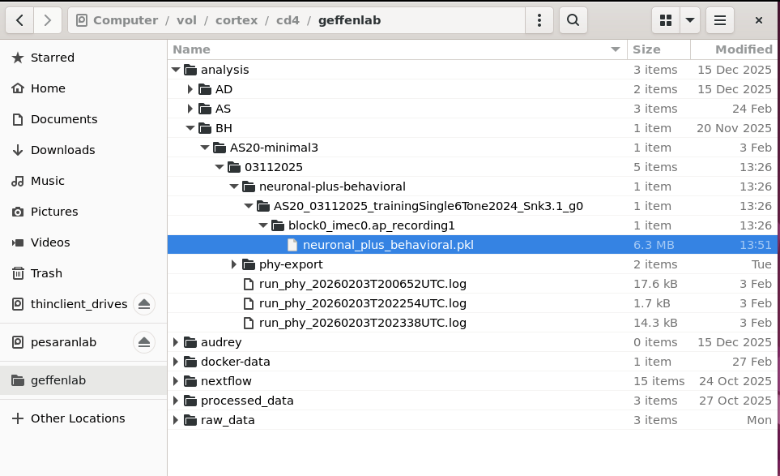
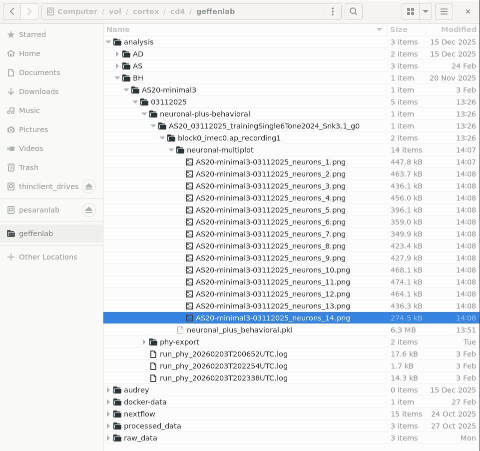
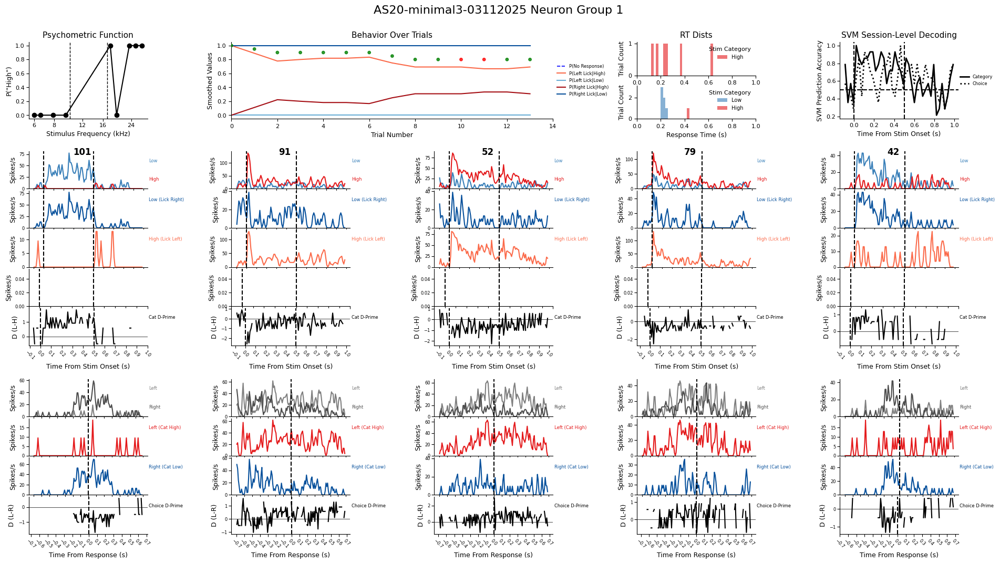

# Downstream Analysis

This doc should help you run downstream analysis, after running the [AIND ephys pipeline](./run-aind-ephys-pipeline.md) and the Geffen lab [Phy export pipeline](./run-phy-export.md).

As an example of downstream analysis, this uses code from the lab's [population-analysis](https://github.com/jcollina/population-analysis) repo.

The script [run_data_collection.py](https://github.com/jcollina/population-analysis/blob/main/run_data_collection.py) combines raw behavior data with processed spike sorting results and saves one or more Python pickles, containing dataframes.

The script [run_neuronal_multiplot.py](https://github.com/jcollina/population-analysis/blob/main/run_neuronal_multiplot.py) uses data in each pickle to generate a series of session summary plots.

# Collect neuronal and behavioral data

Here's how to collect neuronal and behavioral data on cortex into one or more Python pickle files.

## get the `population-analysis` code

You can clone the [population-analysis](https://github.com/jcollina/population-analysis) repo (or your own analysis repo) into your home folder on cortex.
From a cortex terminal:

```
cd ~
git clone https://github.com/jcollina/population-analysis.git
```

## create a Python environment

Running analysis will require several Python dependencies.
We can manage these with Conda.
Create the `population-analysis` environment declared in [population-analysis.yml](https://github.com/jcollina/population-analysis/blob/main/population-analysis.yml).

```
cd ~/population-analysis/
conda env create -f population-analysis.yml 
```

## collect data and save Python pickle(s)

The [run_data_collection.py](https://github.com/jcollina/population-analysis/blob/main/run_data_collection.py) script works like many of our other pipeline [scripts](../scripts/).  It locates data on cortex based on args like `--experimenter`, `--subject`, and `--date`.

```
cd ~/population-analysis
conda activate population-analysis

python run_data_collection.py \
  --experimenter BH \
  --subject AS20-minimal3 \
  --date 03112025
```

This will search within the Geffen lab `/vol/cortex/cd4/geffenlab/raw_data/` directory for raw behavioral data (`.txt` and `.mat` files).

It will also search for events and neuronal sorting/curation results within `/vol/cortex/cd4/geffenlab/analysis/` (tprime event `.txt` and Phy `params.py` etc.).

For a given experimenter, subject, and date, the search might find data from multiple sessions or probes.  It will attempt to match up the behavioral and neuronal data for each session by sorting the search results on session name.

The result of this script should be one or more `neuronal_plus_behavioral.pkl` files, one for each session or probe.  Each `.pkl` file will contain a dictionary of dataframes with neuronal and behavioral data.

The pickles will be written within `/vol/cortex/cd4/geffenlab/analysis`.



# Generate neuronal multiplots

The [run_neuronal_multiplot.py](https://github.com/jcollina/population-analysis/blob/main/run_neuronal_multiplot.py) script also works like many of our other scripts, finding data based on args like `--experimenter`, `--subject`, and `--date`.

```
cd ~/population-analysis
conda activate population-analysis

python run_neuronal_multiplot.py \
  --experimenter BH \
  --subject AS20-minimal3 \
  --date 03112025
```

This will locate each `neuronal_plus_behavioral.pkl` created above, and use the dataframes within to create several "neuronal multiplot" plots.



Each of the multiplot plots should look something like this:



# Running custom analysis code

Where possible, we should use existing [population-analysis](https://github.com/jcollina/population-analysis) code across projects.

The [run_data_collection.py](https://github.com/jcollina/population-analysis/blob/main/run_data_collection.py) script is intended to work on data from rigs that use SpikeGlx and store behavior data in `.txt` and `.mat` files.  This script is intended to "just know" where raw and processed data are stored on cortex, and produce a convenient, portable `.pkl` to support further analysis.  The script takes several parameters to adjust its behavior, in addition to `--experimenter`, `--subject`, and `--date` as used above.  See `python run_data_collection.py --help` for details.

The [run_neuronal_multiplot.py](https://github.com/jcollina/population-analysis/blob/main/run_neuronal_multiplot.py) is one example of what to do with the collected `.pkl` data.  You can use this if it's helful, and/or copy and modify it.

For other kinds of rig data, or other downstream plotting and analysis, you might need to write new code.  You might start with a copy of [run_data_collection.py](https://github.com/jcollina/population-analysis/blob/main/run_data_collection.py) or [run_neuronal_multiplot.py](https://github.com/jcollina/population-analysis/blob/main/run_neuronal_multiplot.py), save it to your own repo, then modify it from there.

Even if you write custom collection or analysis code, the overall workflow could still be the same:
 - Upload rig data to cortex and run pipelines using the scipts in this repo.
 - Clone this and/or your own analysis repo into your home folder on cortex.
 - Set up your own Conda environment(s) similar to [population-analysis.yml](https://github.com/jcollina/population-analysis/blob/main/population-analysis.yml).
 - Use [run_data_collection.py](https://github.com/jcollina/population-analysis/blob/main/run_data_collection.py) or your own script to collect data from cortex and save to a convenient, portable `.pkl` file.
 - Use [run_neuronal_multiplot.py](https://github.com/jcollina/population-analysis/blob/main/run_neuronal_multiplot.py) and/or your own script(s) to read each `.pkl` and do analysis and plotting.

When you're done running things on cortex you can download your analysis products from cortex -- see [download-results.md](./download-results.md).
