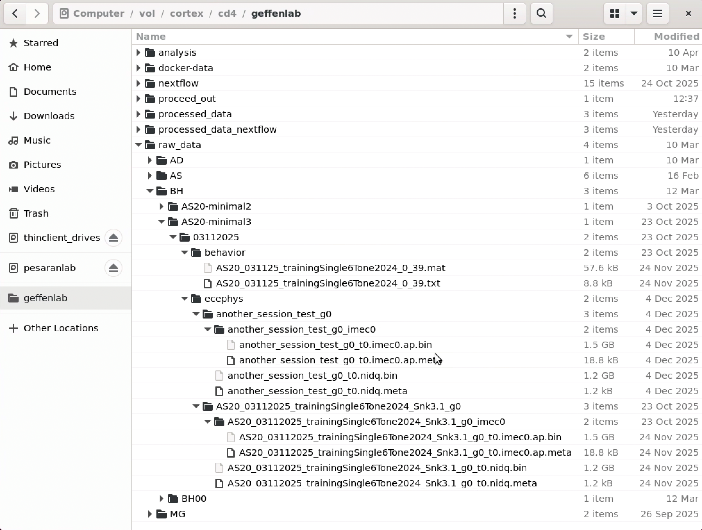
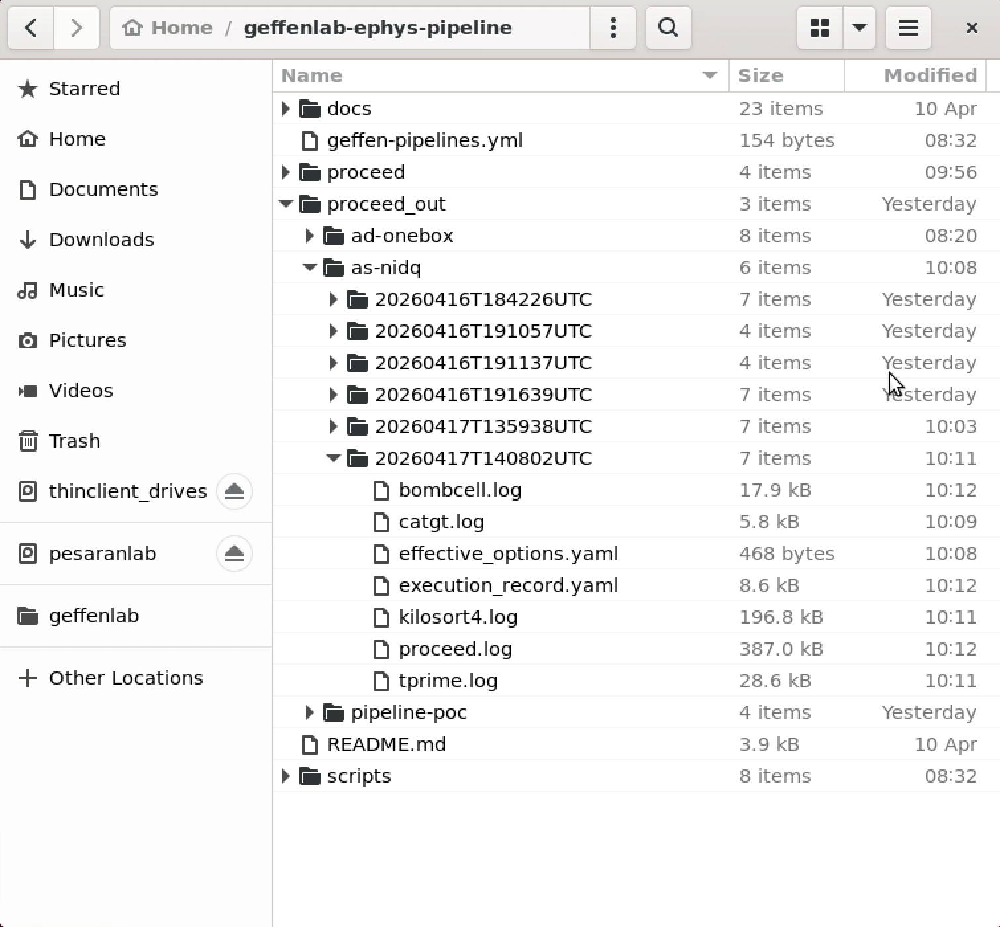
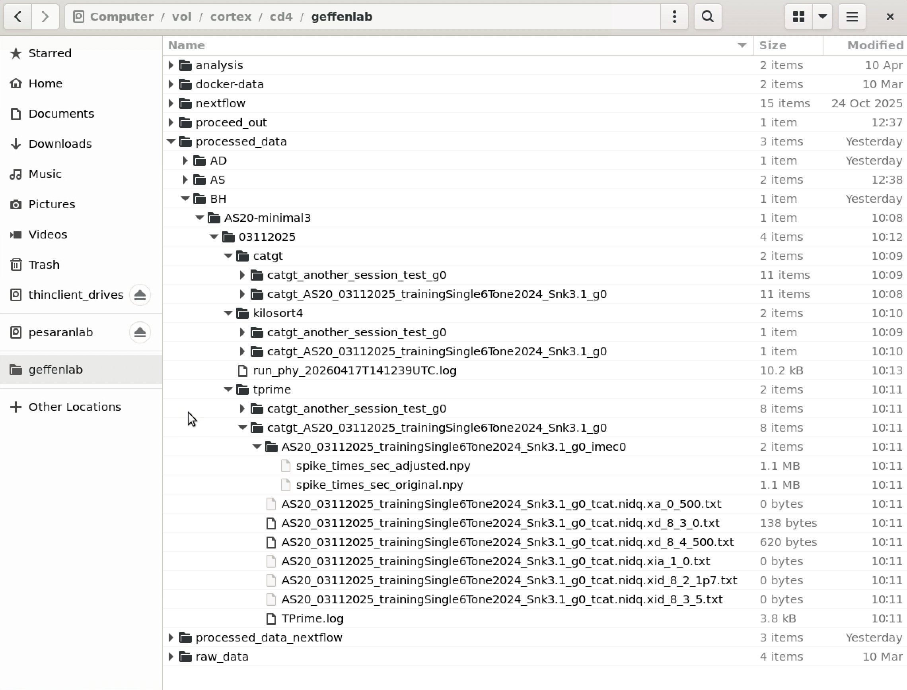

# Pipeline Test Run

This document should help do a pipeline test run with a small, known dataset.
Before running this you should do [cortex-user-](./cortex-user-setup.md).

# Test data

We have a minimal dataset already on cortex, which represents a few trials [extracted](https://github.com/benjamin-heasly/geffenlab-minimal-data) from an original `AS20` dataset.
The data sit within our cortex storage directory (`/vol/cortex/cd4/geffenlab/raw_data`) organized by experimenter (`BH`), subject (`AS20-minimal3`), date (`03112025`), and modality (`behavior` and `ephys`).



This dataset contains two "run" subdirectories, as created by SpikeGlx.
The pipeline looks for multiple runs to process in sequence.
It also supports one or multiple probes like `imec0`, `imec1`, etc.
It expectes probe subdirectories within each run subdirectory.

# Old processing results

Since this is a test dataset, we might be re-processing it many times.
To keep things clean and avoid confustion, delete any previous processing results for this dataset within `/vol/cortex/cd4/geffenlab/processed_data`.

```
rm -rf /vol/cortex/cd4/geffenlab/processed_data/BH/AS20-minimal3/03112025/
```

# Pipeline run

This dataset was collected with a SpikeGLX-plus-NIDQ rig.
Our [as-nidq.yaml](../proceed/as-nidq.yaml) is a good fit for processing it.

Use the `proceed run` command and specify:
 - `proceed/as-nidq.yaml` for the pipeline itself
 - several `args` for the experimenter (`BH`), subject (`AS20-minimal3`), and date (`03112025`)

```
conda activate geffen-pipelines
cd ~/geffenlab-ephys-pipeline

proceed run proceed/as-nidq.yaml --args experimenter=BH subject=AS20-minimal3 date="03112025"
```

This should take several minutes, but not many, to complete.

Proceed prints a lot of logging information to the console.
It also saves the same logging information, and more, in a local `proceed_out` subdirectory.
Within `proceed_out` logs are organized by pipeline name, date, and step name.



The pipeline writes results into `/vol/cortex/cd4/geffenlab/processed_data`.
Within this directory outputs are organized by experimenter, subject, date, piipeline step name, SpikeGLX run, and probe.



This example shows outputs from pipeline steps `catgt`, `kilosort4`, and `tprime`.

# Phy

You can view and curate the sorting results on cortex using Phy.
For performance reasons, you might want to download the results and run Phy locally.

You can also run Phy directly on cortex without moving the data.

```
conda activate geffen-pipelines
cd ~/geffenlab-ephys-pipeline/scripts

python run_phy.py --experimenter BH --subject AS20-minimal3 --date "03112025"
```

# Further processing

If you were able to complete this test run, that means your cortex account is configured for running our pipelines.
To process your own data, you can run proceed and specify a different experimenter, subject, and/or date.
You may also need to specify a different pipeline YAML to `proceed run`, one suitable for your rig.
These are stored in the [proceed/](../proceed/) subdirectory of this repo.
