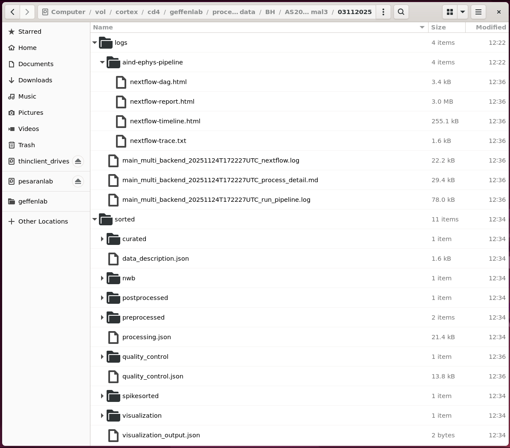

# Run AIND ephys pipeline

This doc should help you run the [AIND ephys pipeline](https://github.com/AllenNeuralDynamics/aind-ephys-pipeline) for spike sorting and quality metrics.

Before running this you'll need to do one-time [cortex user setup](./cortex-user-setup.md) for your cortex user account and local lab machine.

You'll also need to [upload-data](./upload-data.md) for your session to cortex.

## Pipeline configuration and arguments

For spike sorting, we use the [AIND ephys pipeline](https://github.com/AllenNeuralDynamics/aind-ephys-pipeline) Nextflow code as-is.

We combine this with our own Nextflow configuration file which tells Nextflow to do things like:
 - Locate Geffen lab data and results within `/vol/cortex/cd4/geffenlab/`.
 - Share CPU, GPU, and RAM with other cortex users.

To run the pipeline, use our Python script [run_pipeline.py](./scripts/run_pipeline.py).
This script calls `nextflow run` for the pipeline itself, and also saves detailed logs within the `processed_data` subdirectory directory for each session.

We tell the script which pipeline to run with the `--workflow` argument.  We specifiy the configuration to use with `--config`.  We also pass the `experimenter`, `--subject`, and `--date` for the session we want to process.

The `--input` parameter can be `spikeglx` or `openephys`, to tell the AIND pipeline what type of data to read.

## Run the pipeline

To run the pipeline, connect to cortex via remote desktop and open a terminal window.
Run the following command (or similar, depending on your data).

```
cd /vol/cortex/cd4/geffenlab/nextflow/geffenlab-ephys-pipeline/scripts
conda activate geffen-pipelines

python run_pipeline.py \
  --workflow aind-ephys-pipeline/pipeline/main_multi_backend.nf \
  --config geffenlab-ephys-pipeline/aind-ephys-pipeline/cortex.config \
  --experimenter BH \
  --subject AS20-minimal3 \
  --date 03112025 \
  --input spikeglx
```

The pipeline run should take less than an hour.  A clean run should end with a summary like this:

```
2025-11-24 12:36:01,706 [INFO] Completed at: 24-Nov-2025 12:36:01
2025-11-24 12:36:01,706 [INFO] Duration    : 13m 29s
2025-11-24 12:36:01,706 [INFO] CPU hours   : 2.3
2025-11-24 12:36:01,706 [INFO] Succeeded   : 11
```

## Results overview

The pipeline looks for raw session ephys data within the lab's sotrage directory, `/vol/cortex/cd4/geffenlab/`.
For the session in this example, the raw session data would be located at `/vol/cortex/cd4/geffenalb/raw_data/BH/AS20-minimal3/03112025/`.

Pipeline logs, diagnostic plots, spike sorting results, and results of automated curation by SpikeInterface go in the lab's `processed_data/` directory.
For the session in this example, the processed results would be located at `/vol/cortex/cd4/geffenalb/processed_data/BH/AS20-minimal3/03112025/`:


