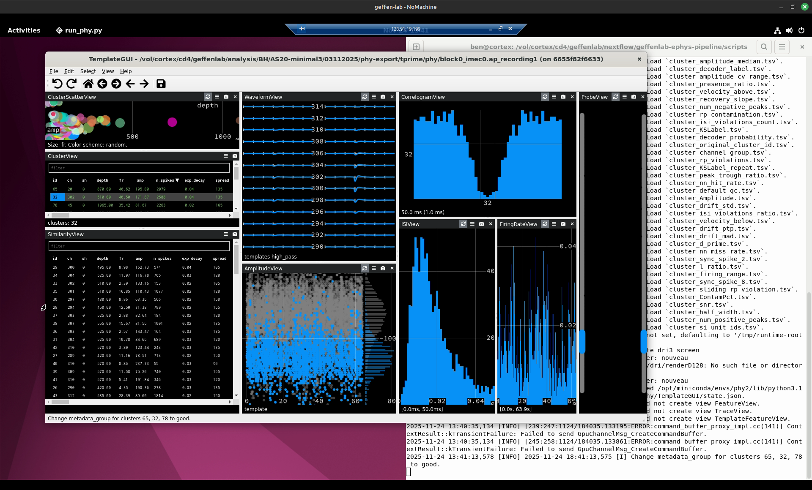
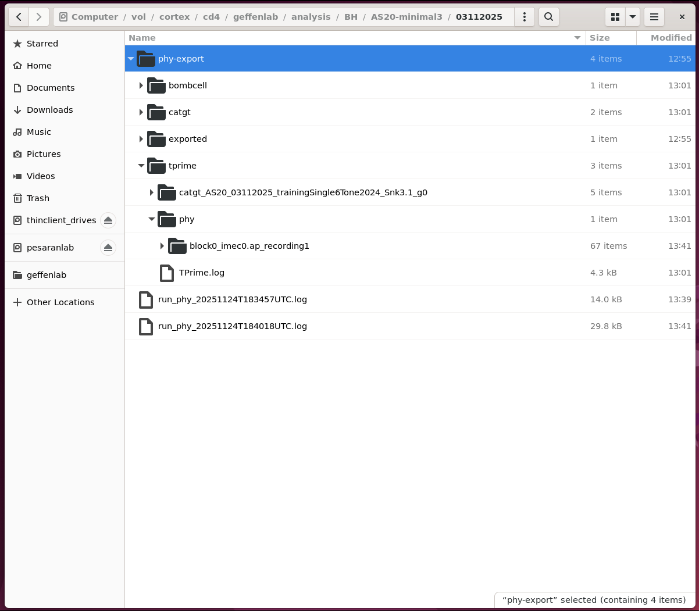
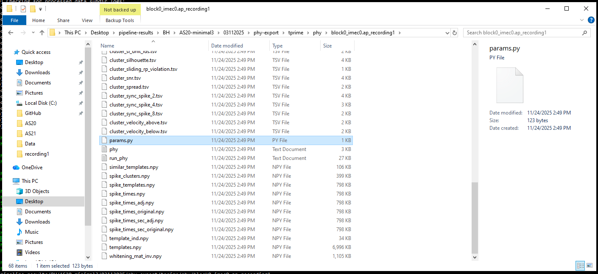

# Run Phy

This doc should help you run Phy for manual sorting curation.

Before running this you must run the Geffen lab's [phy-export.nf](../phy-export/phy-export.nf) Nextflow pipeline.

## Cortex vs local run

We have two options for running Phy: on cortex via remote desktop, or locally, via data download.

Running on cortex via remote desktop is intended to be the simpler and more convenient option.
However, we are still working on making the remote desktop and interactive Phy GUI performant and low-latency.
Until then, downloading the data and running Phy locally may be more practical.

## Phy on cortex remote desktop

You can run Phy on cortex via remote desktop using our [run_phy.py](../scripts/run_phy.py).

This script calls `docker run` to start a Docker container with Phy installed in it.
The script will make the necessary session `analysis/` subdirectory available within the container.

We tell the script which session to use via the `--experimenter`, `--subject`, and `--date` arguments.

Connect to cortex via remote desktop and open a terminal window.
Run the following commands (or similar, depending on your data).

```
cd /vol/cortex/cd4/geffenlab/nextflow/geffenlab-ephys-pipeline/scripts
conda activate geffen-pipelines

python run_phy.py \
  --experimenter BH \
  --subject AS20-minimal3 \
  --date 03112025
```

### Selecting a Phy subdirectory.

The script will search the cortex `analysis/` subdirectory for the given session, for `params.py` files and the associated directories of `.tsv` and `.npy` files.
It might find multuple Phy directories, as from multiple probes, recordings, or stages of processing.
If so, it will prompt you to choose one of them by number.

```
2025-11-24 13:40:18,344 [INFO] Writing logs for this script to stdout and /vol/cortex/cd4/geffenlab/analysis/BH/AS20-minimal3/03112025/run_phy_20251124T184018UTC.log
2025-11-24 13:40:18,344 [INFO] Using Docker image: ghcr.io/benjamin-heasly/geffenlab-phy-desktop:v0.0.4
2025-11-24 13:40:18,344 [INFO] Using 'docker run' args: ['--rm']
2025-11-24 13:40:18,344 [INFO] Using GPU device: 0
2025-11-24 13:40:18,344 [INFO] Configuring X11 display: True
2025-11-24 13:40:18,344 [INFO] Running container as user and group: None
2025-11-24 13:40:18,344 [INFO] Looking for phy/ data in: /vol/cortex/cd4/geffenlab/analysis/BH/AS20-minimal3/03112025
2025-11-24 13:40:18,344 [INFO] Looking for params.py files(s) matchign pattern: **/params.py
2025-11-24 13:40:18,345 [INFO] Found 2 params.py matches.
2025-11-24 13:40:18,345 [INFO] Please choose one:
2025-11-24 13:40:18,345 [INFO]   0: /vol/cortex/cd4/geffenlab/analysis/BH/AS20-minimal3/03112025/phy-export/exported/phy/block0_imec0.ap_recording1/params.py
2025-11-24 13:40:18,345 [INFO]   1: /vol/cortex/cd4/geffenlab/analysis/BH/AS20-minimal3/03112025/phy-export/tprime/phy/block0_imec0.ap_recording1/params.py
Choose by number 0-1: 1
2025-11-24 13:40:21,552 [INFO] Using params.py: /vol/cortex/cd4/geffenlab/analysis/BH/AS20-minimal3/03112025/phy-export/tprime/phy/block0_imec0.ap_recording1/params.py
2025-11-24 13:40:21,552 [INFO] Starting Phy run.
```

### Phy GUI on cortex

The script should proceed to launch a Docker container with the interactive Phy GUI installed.
This should appear along with your terminal window, within your cortex remote desktop session.



You should be able to curate using the interactive GUI, save results, and exit the GUI.
When you're done, the script should exit.

Your curation results should be saved within the Phy directory that you chose, in this example, `phy-export/tprime/phy/block0_imec0.ap_recording1/params.py`.

The script will also save a log from your Phy run within the overall session `analysis/` subdirectory, and within the selected Phy subdirectory itself.



## Phy local with data download

You can run Phy locally if you first download the session `analysis/` subdirectory.
See [download-results.md](./download-results.md) for how to do this.

## Running Phy (any old way)

If you've installed and used Phy locally in the past, try running it like you have before.
The `params.py` will be located within your local `pipeline-results/` folder.
For example: `/mnt/c/Users/labuser/Desktop/pipeline-results/BH/AS20-minimal3/03112025/phy-export/tprime/phy/block0_imec0.ap_recording1/params.py`.



## Running Phy (Docker)

You can also use Docker to run the same kind of Phy container that we use on cortex -- but locally.
For this to work you'll need to install Docker locally, for example [Docker Desktop for Windows](https://docs.docker.com/desktop/setup/install/windows-install/).

With that you can point the same [run_phy.py](../scripts/run_phy.py) script at your local `pipeline-results/`.
Run this script from the WSL environment of your local lab machine:

```
cd ~/geffenlab-ephys-pipeline/scripts
conda activate geffen-pipelines

# Run our results download Python script.
python run_phy.py \
  --gpu-device none \
  --user self \
  --analysis-root /mnt/c/Users/labuser/Desktop/pipeline-results/analysis \
  --experimenter BH \
  --subject AS20-minimal3 \
  --date 03112025
```

You should be able to curate using the interactive GUI, save results, and exit the GUI.
When you're done, the script should exit.

As on cortex, your curation results should be saved within the Phy directory that you chose, in this example, `phy-export/tprime/phy/block0_imec0.ap_recording1/params.py`.
The script will also save a log from your Phy run within the overall session `analysis/` subdirectory, and within the selected Phy subdirectory itself.

These results will all be saved locally, within your local `pipeline-results/` folder.

## Uploading

When you're done curating locally you can upload the session `analysis/` subdirectory back to cortex.
See [upload-analysis.md](./upload-analysis.md).
