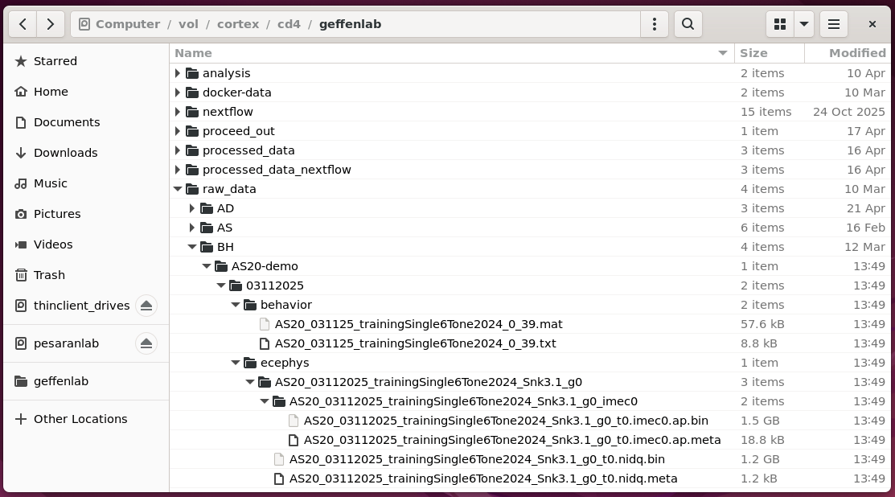
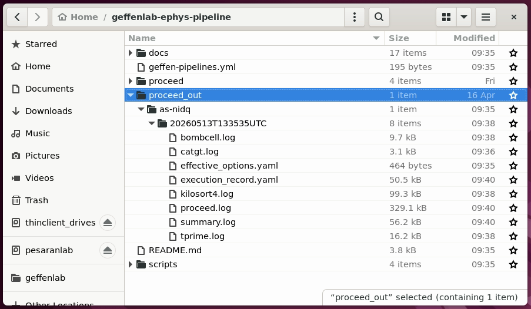
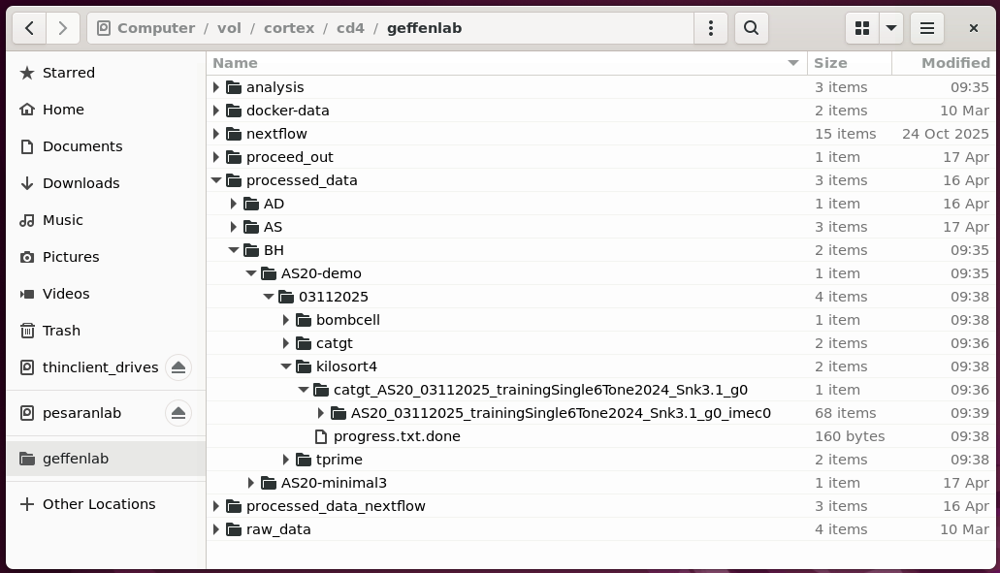
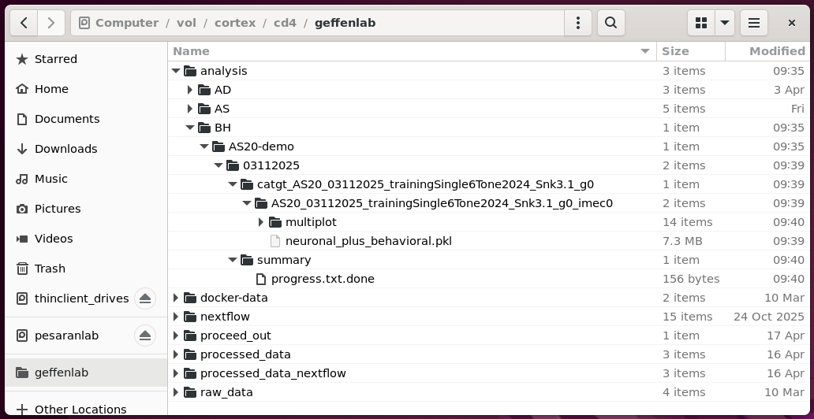

# Run Proceed

This document should help you run a processing pipeline using [Proceed](https://benjamin-heasly.github.io/proceed/) along with one of the lab's [pipeline definition YAML files](../proceed/).

Before running this you should do initial [cortex-user-setup.md](./cortex-user-setup.md).

# Test with small dataset

This seciton shows how to do a full pipeline run with a small dataset.
Run the commands below from a terminal on cortex (see [cortex-remote-desktop-connection](./cortex-user-setup.md#cortex-remote-desktop-connection)).

First, remove outputs from any previous test runs.

```
rm -rf /vol/cortex/cd4/geffenlab/processed_data/BH/AS20-demo/03112025/
rm -rf /vol/cortex/cd4/geffenlab/analysis/BH/AS20-demo/03112025/
```

The small, `AS20-demo` dataset came from a SpikeGLX-plus-NIDQ rig.
Our [as-nidq.yaml](../proceed/as-nidq.yaml) is a good fit for processing it.

Use the `proceed run` command and specify:
 - `proceed/as-nidq.yaml` for the pipeline definition
 - several `args` for the experimenter (`BH`), subject (`AS20-demo`), and date (`03112025`)

```
# Use our conda environment with Python, etc.
conda activate geffen-pipelines

cd ~/geffenlab-ephys-pipeline
proceed run proceed/as-nidq.yaml --args experimenter=BH subject=AS20-demo date="03112025"
```

For the samll dataset, processing should take about 5-10 minutes to complete.

## raw data inputs

The pipeline will look for raw data within a subfolder of `/vol/cortex/cd4/geffenlab/raw_data`.  It will expect data to use a standard directory structure based on experimenter, subject and date -- as in [upload-data.md](./upload-data.md).



## logging outputs

Proceed will print a lot of logging information to the console.
It will also save the same logging information, and more, in a `proceed_out` subdirectory of the current working directory.  This will contain logs organized by pipeline name, date, and step name.



## processed data and analysis outputs

The pipeline writes intermediate processing results into a subdirectory of `/vol/cortex/cd4/geffenlab/processed_data`, with results organized by experimenter, subject, date, step name, SpikeGLX run, and probe.



It also writes final, summarized results into a subdirectory of `/vol/cortex/cd4/geffenlab/analysis`, with results organized by experimenter, subject, date, SpikeGLX run, and probe.



# Run with full datasets

The pipeline can run on full datasets as well, with the same overall flow of inputs and outpus.
See [upload-data.md](./upload-data.md) to get you full dataset on cortex.

You'll need to select a pipeline definition YAML file that's suitable for your data.
As of writing we have two:
 - [as-nidq.yaml](../proceed/as-nidq.yaml) is a good fit for a SpikeGLX-plus-NIDQ rig.
 - [ad-onebox.yaml](../proceed/ad-onebox.yaml) is a good fit for a SpikeGLX-plus-OneBox rig with a continuous treadmill signal.

Here are some examples of running full SpikeGLX-plus-NIDQ sessions.

```
conda activate geffen-pipelines
cd ~/geffenlab-ephys-pipeline

# single-probe NIDQ session
proceed run proceed/as-nidq.yaml --args experimenter=AS subject=AS20 date="03112025"

# dual-probe NIDQ session
proceed run proceed/as-nidq.yaml --args experimenter=AS subject=AS40 date="01062026"
```

Here are some examples of running full SpikeGLX-plus-OneBox sessions.

```
conda activate geffen-pipelines
cd ~/geffenlab-ephys-pipeline

# longer sessions with OneBox and treadmill continuous signal
proceed run proceed/ad-onebox.yaml --args experimenter=AD subject=AD025 date="03102026"
proceed run proceed/ad-onebox.yaml --args experimenter=AD subject=AD025 date="03112026"
```

These procesing runs may take a few hours to complete.

## Configuring pipelines

Please see [pipeline-config.md](./pipeline-config.md) for more details about how to configure various pipeline options.
For a new rig, it might be that you can reuse an existing pipeline, and only have to specify a few rig-specific specific parameters like CatGT or TPrime arguments, or probe-specific parameters for Kilosort4 or Bombcell.

# Reprocessing a datset

You can re-run a pipeline on the same dataset.
This could be useful if you want to run a new version of the pipeline or an individual step.

Reprocessing might also be useful if you modify some of the intermediate data, for example during interactive curation with Phy (see [run-phy.md](./run-phy.md)).

Here are a few ways to reprocess a dataset.

## erase and start fresh

At the most extreme, you can delete old processing results and run everything fresh.
For example with experimenter `BH`, subject `AS20-demo`, and date `03112025`, you could remove all pipeline outputs like this:

```
rm -rf /vol/cortex/cd4/geffenlab/processed_data/BH/AS20-demo/03112025/
rm -rf /vol/cortex/cd4/geffenlab/analysis/BH/AS20-demo/03112025/
```

Use caution when deleting files!

## overwrite old results with `--force-rerun`

You can also re-run a pipeline and let it overwrite old processing results.

For example:

```
conda activate geffen-pipelines
cd ~/geffenlab-ephys-pipeline

proceed run proceed/as-nidq.yaml --args experimenter=BH subject=AS20-demo date="03112025" --force-rerun
```

Note the `--force-rerun` flag passed to `proceed run`.
Normally Proceed will keep track of which steps have already completed, for a given dataset, and it will skip those steps on subsequent runs.
Passing `--force-rerun` tells Proceed to always re-run completed steps.

## run specific steps with `--step-names`

You can also ask proceed to re-run specific pipeline steps, instead of starting from the beginning.

For example:

```
conda activate geffen-pipelines
cd ~/geffenlab-ephys-pipeline

proceed run proceed/as-nidq.yaml --args experimenter=BH subject=AS20-demo date="03112025" --force-rerun --step-names bombcell summary
```

The arguments `--step-names bombcell summary` tell proceed to run only two steps: `bombcell` and `summary`.  This assumes previous steps have already completed.

Rerunning steps like these might be useful following interactive curation with Phy (see [run-phy.md](./run-phy.md)).

The names of the steps are declared in each pipeline YAML file.
Each block of text in the `steps:` section of the YAML begins with a name, like `- name: bombcell` or `- name: summary`.
