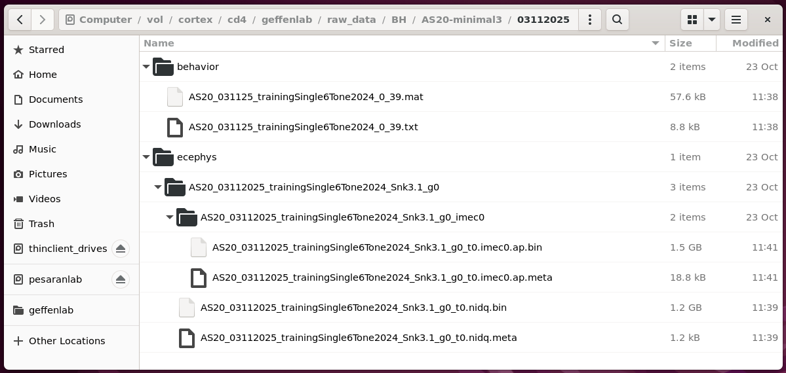

# Cortex Upload Data

This doc should help you upload session data from a local lab machine to cortex.

First, you'll need to do the one-time [cortex user setup](./cortex-user-setup.md) for your cortex user account and local lab machine.

## Upload data to cortex

This repo has a Python script [upload_data.py](./scripts/upload_data.py) that should help uploading data from your local lab machine to cortex.  Internally this uses `ssh` to connect to cortex using your own user credentials.

Run this script from the WSL environment of your local lab machine:

```
# Go to the directory that contains your data.
# For example:
cd /mnt/c/Users/labuser/Desktop/Data/

# Run the data upload Python script.
conda activate geffen-pipelines
python ~/geffenlab-ephys-pipeline/scripts/upload_data.py
```

This will prompt you for the experimenter initials, subject id, and session date(s) that you want to upload.  You can optionally specify a qualifier to further narrow down which files are uploaded.  For example:

```
2025-11-24 11:37:24,413 [INFO] Uploading behavior files from: /mnt/c/Users/labuser/Desktop/Data
2025-11-24 11:37:24,413 [INFO] Using behavior .txt pattern: <SUBJECT>/**/*_<MM><DD><YY>_*.txt
2025-11-24 11:37:24,413 [INFO] Using behavior .mat pattern: <SUBJECT>/**/*_<MM><DD><YY>_*.mat
2025-11-24 11:37:24,413 [INFO] Using behavior .hdf5 pattern: <SUBJECT>/**/*_<YYYY><MM><DD>_*.hdf5
2025-11-24 11:37:24,413 [INFO] Uploading ephys files from: /mnt/c/Users/labuser/Desktop/Data
2025-11-24 11:37:24,413 [INFO] Using SpikeGLX .meta pattern: <SUBJECT>/**/*_<MM><DD><YYYY>_*.meta
2025-11-24 11:37:24,413 [INFO] Using Open Ephys .oebin pattern: <SUBJECT>/**/<YYYY>-<MM>-<DD>_*/*/*/*/structure.oebin
2025-11-24 11:37:24,413 [INFO] Uploading files to remote host: 128.91.19.199
2025-11-24 11:37:24,413 [INFO] Uploading files to remote raw data root: /vol/cortex/cd4/geffenlab/raw_data
Experimenter initials: BH
2025-11-24 11:37:26,588 [INFO] Uploading files for experimenter: BH
Subject ID: AS20-minimal3
2025-11-24 11:37:31,850 [INFO] Uploading files for subject id: AS20-minimal3
Session date MMDDYYYY (multiple dates may be separated by spaces): 03112025
2025-11-24 11:37:36,560 [INFO] Uploading files for session date(s): ['2025-03-11']
Qualifier like 'training','ap.bin', 'recording1', etc.  Leave blank to upload all:
2025-11-24 11:37:38,150 [INFO] Uploading all files.
Remote username: ben
```

Based on the subject id, session date(s), and optional qualifier, the script will search local directories for behavior and ecephys files.  It will use [glob](https://docs.python.org/3/library/glob.html) patterns to select specific files of interest.  The defaults are intended to match:
 - behavior `.mat`, `.txt` and/or `.hdf5` files
 - SpikeGlx `.meta` files, and their containing run directories
 - OpenEphys `.oebin` files, and their containing session directories

```
2025-11-24 11:37:42,580 [INFO] Uploading files as remote user: ben
2025-11-24 11:37:42,580 [INFO] Looking for session date: 2025-03-11 AKA 03112025
2025-11-24 11:37:42,580 [INFO] Searching local behavior_root for .txt like: AS20-minimal3/**/*_031125_*.txt
2025-11-24 11:37:42,595 [INFO]   AS20-minimal3/AS20-minimal3/03112025/behavior/AS20_031125_trainingSingle6Tone2024_0_39.txt
2025-11-24 11:37:42,612 [INFO] Searching local behavior_root for .mat like: AS20-minimal3/**/*_031125_*.mat
2025-11-24 11:37:42,623 [INFO]   AS20-minimal3/AS20-minimal3/03112025/behavior/AS20_031125_trainingSingle6Tone2024_0_39.mat
2025-11-24 11:37:42,641 [INFO] Searching local behavior_root for .hdf5 like: AS20-minimal3/**/*_20250311_*.hdf5
2025-11-24 11:37:42,670 [INFO] Searching local ephys_root for .meta like: AS20-minimal3/**/*_03112025_*.meta
2025-11-24 11:37:42,698 [INFO] Found 2 .meta matches: [PosixPath('/mnt/c/Users/labuser/Desktop/Data/AS20-minimal3/AS20-minimal3/03112025/ecephys/AS20_03112025_trainingSingle6Tone2024_Snk3.1_g0/AS20_03112025_trainingSingle6Tone2024_Snk3.1_g0_t0.nidq.meta'), PosixPath('/mnt/c/Users/labuser/Desktop/Data/AS20-minimal3/AS20-minimal3/03112025/ecephys/AS20_03112025_trainingSingle6Tone2024_Snk3.1_g0/AS20_03112025_trainingSingle6Tone2024_Snk3.1_g0_imec0/AS20_03112025_trainingSingle6Tone2024_Snk3.1_g0_t0.imec0.ap.meta')]
2025-11-24 11:37:42,698 [INFO] Found spikeglx run dir: /mnt/c/Users/labuser/Desktop/Data/AS20-minimal3/AS20-minimal3/03112025/ecephys/AS20_03112025_trainingSingle6Tone2024_Snk3.1_g0
2025-11-24 11:37:42,704 [INFO]   AS20-minimal3/AS20-minimal3/03112025/ecephys/AS20_03112025_trainingSingle6Tone2024_Snk3.1_g0/AS20_03112025_trainingSingle6Tone2024_Snk3.1_g0_t0.nidq.bin
2025-11-24 11:37:42,704 [INFO]   AS20-minimal3/AS20-minimal3/03112025/ecephys/AS20_03112025_trainingSingle6Tone2024_Snk3.1_g0/AS20_03112025_trainingSingle6Tone2024_Snk3.1_g0_t0.nidq.meta
2025-11-24 11:37:42,704 [INFO]   AS20-minimal3/AS20-minimal3/03112025/ecephys/AS20_03112025_trainingSingle6Tone2024_Snk3.1_g0/AS20_03112025_trainingSingle6Tone2024_Snk3.1_g0_imec0/AS20_03112025_trainingSingle6Tone2024_Snk3.1_g0_t0.imec0.ap.bin
2025-11-24 11:37:42,705 [INFO]   AS20-minimal3/AS20-minimal3/03112025/ecephys/AS20_03112025_trainingSingle6Tone2024_Snk3.1_g0/AS20_03112025_trainingSingle6Tone2024_Snk3.1_g0_imec0/AS20_03112025_trainingSingle6Tone2024_Snk3.1_g0_t0.imec0.ap.meta
2025-11-24 11:37:42,705 [INFO] Searching local ephys_root for .oebin like: AS20-minimal3/**/2025-03-11_*/*/*/*/structure.oebin
2025-11-24 11:37:42,735 [INFO] Found 0 .oebin matches: []
```

From all the files found, the script can use the optional qualifier to further restrict which files will be uploaded.  When the qualifier is provided, only files that contain the qualifier in their name will be uploaded.  For example, the qualifier "training" could be used to select "training" files but ignore "testing" files.

Before uploading, the script will show which files it plans to create on cortex and prompt for your confirmation.

```
2025-11-24 11:37:42,735 [INFO] Planning to create 6 files in remote dir /vol/cortex/cd4/geffenlab/raw_data:
2025-11-24 11:37:42,735 [INFO]   BH/AS20-minimal3/03112025/behavior/AS20_031125_trainingSingle6Tone2024_0_39.txt
2025-11-24 11:37:42,735 [INFO]   BH/AS20-minimal3/03112025/behavior/AS20_031125_trainingSingle6Tone2024_0_39.mat
2025-11-24 11:37:42,735 [INFO]   BH/AS20-minimal3/03112025/ecephys/AS20_03112025_trainingSingle6Tone2024_Snk3.1_g0/AS20_03112025_trainingSingle6Tone2024_Snk3.1_g0_t0.nidq.bin
2025-11-24 11:37:42,736 [INFO]   BH/AS20-minimal3/03112025/ecephys/AS20_03112025_trainingSingle6Tone2024_Snk3.1_g0/AS20_03112025_trainingSingle6Tone2024_Snk3.1_g0_t0.nidq.meta
2025-11-24 11:37:42,736 [INFO]   BH/AS20-minimal3/03112025/ecephys/AS20_03112025_trainingSingle6Tone2024_Snk3.1_g0/AS20_03112025_trainingSingle6Tone2024_Snk3.1_g0_imec0/AS20_03112025_trainingSingle6Tone2024_Snk3.1_g0_t0.imec0.ap.bin
2025-11-24 11:37:42,736 [INFO]   BH/AS20-minimal3/03112025/ecephys/AS20_03112025_trainingSingle6Tone2024_Snk3.1_g0/AS20_03112025_trainingSingle6Tone2024_Snk3.1_g0_imec0/AS20_03112025_trainingSingle6Tone2024_Snk3.1_g0_t0.imec0.ap.meta
Do you want to upload these 6 files?  Type 'yes' to proceed: yes
```

You must type `yes` to proceed.  Otherwise the script will exit before uploading.
If you do type `yes` the script will prompt for your cortex user password and, then upload each file to cortex:

```
2025-11-24 11:37:52,237 [WARNING] Proceeding to upload files.
Password for remote user ben:
2025-11-24 11:38:00,688 [INFO] Connecting to remote host: 128.91.19.199.
2025-11-24 11:38:10,674 [INFO] Connected (version 2.0, client OpenSSH_8.9p1)
2025-11-24 11:38:10,796 [INFO] Authentication (password) successful!
2025-11-24 11:38:10,796 [INFO] Uploading to /vol/cortex/cd4/geffenlab/raw_data:
2025-11-24 11:38:10,796 [INFO]   BH/AS20-minimal3/03112025/behavior/AS20_031125_trainingSingle6Tone2024_0_39.txt
2025-11-24 11:38:15,735 [INFO] [chan 1] Opened sftp connection (server version 3)
2025-11-24 11:38:15,835 [INFO]   BH/AS20-minimal3/03112025/behavior/AS20_031125_trainingSingle6Tone2024_0_39.mat
2025-11-24 11:38:16,032 [INFO]   BH/AS20-minimal3/03112025/ecephys/AS20_03112025_trainingSingle6Tone2024_Snk3.1_g0/AS20_03112025_trainingSingle6Tone2024_Snk3.1_g0_t0.nidq.bin
2025-11-24 11:39:38,510 [INFO]   BH/AS20-minimal3/03112025/ecephys/AS20_03112025_trainingSingle6Tone2024_Snk3.1_g0/AS20_03112025_trainingSingle6Tone2024_Snk3.1_g0_t0.nidq.meta
2025-11-24 11:39:38,809 [INFO]   BH/AS20-minimal3/03112025/ecephys/AS20_03112025_trainingSingle6Tone2024_Snk3.1_g0/AS20_03112025_trainingSingle6Tone2024_Snk3.1_g0_imec0/AS20_03112025_trainingSingle6Tone2024_Snk3.1_g0_t0.imec0.ap.bin
2025-11-24 11:41:22,656 [INFO]   BH/AS20-minimal3/03112025/ecephys/AS20_03112025_trainingSingle6Tone2024_Snk3.1_g0/AS20_03112025_trainingSingle6Tone2024_Snk3.1_g0_imec0/AS20_03112025_trainingSingle6Tone2024_Snk3.1_g0_t0.imec0.ap.meta
2025-11-24 11:41:22,953 [INFO] Setting 'group' and 'other' permissions for session dir /vol/cortex/cd4/geffenlab/raw_data/BH/AS20-minimal3/03112025:
2025-11-24 11:41:23,163 [INFO] [chan 1] sftp session closed.
2025-11-24 11:41:23,163 [INFO] OK.
```

## Options

The example above used several default options like the cortex host address, the local directories to search for behavior and spikeglx files, and the lab's assigned data directory on cortex.
All of these can be modified from the command line as needed.

You can also specify many values like `--experimenter`, `--subject`, `--date`, and `--qualifier` on the command line instead of waiting for the script to prompt you interactively.  The only argument you can not speicy on the command line is your cortex user password -- this is to prevent your password from being saved into your terminal command history.

For details of command line options please see:

```
python geffenlab-ephys-pipeline/scripts/upload_data.py --help
```

## Uploading multiple dates at once

For the `--date` command line option, or when prompted interactively for session dates, you can provide one or more session dates separated by spaces for the script to search and upload.

For example:

```
python geffenlab-ephys-pipeline/scripts/upload_data.py --date 03112025 03122025 03132025
```

```
Session date MMDDYYYY (multiple dates may be separated by spaces): 03112025 03122025 03132025
```

## Results overview

Matching session behavior and ephys data should now be on cortex, within the lab's sotrage directory, `/vol/cortex/cd4/geffenlab/`.

For the session in this example, the raw session data should be located at `/vol/cortex/cd4/geffenalb/raw_data/BH/AS20-minimal3/03112025/`:


