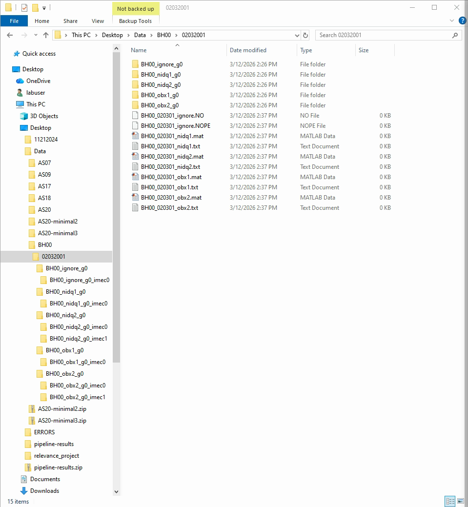
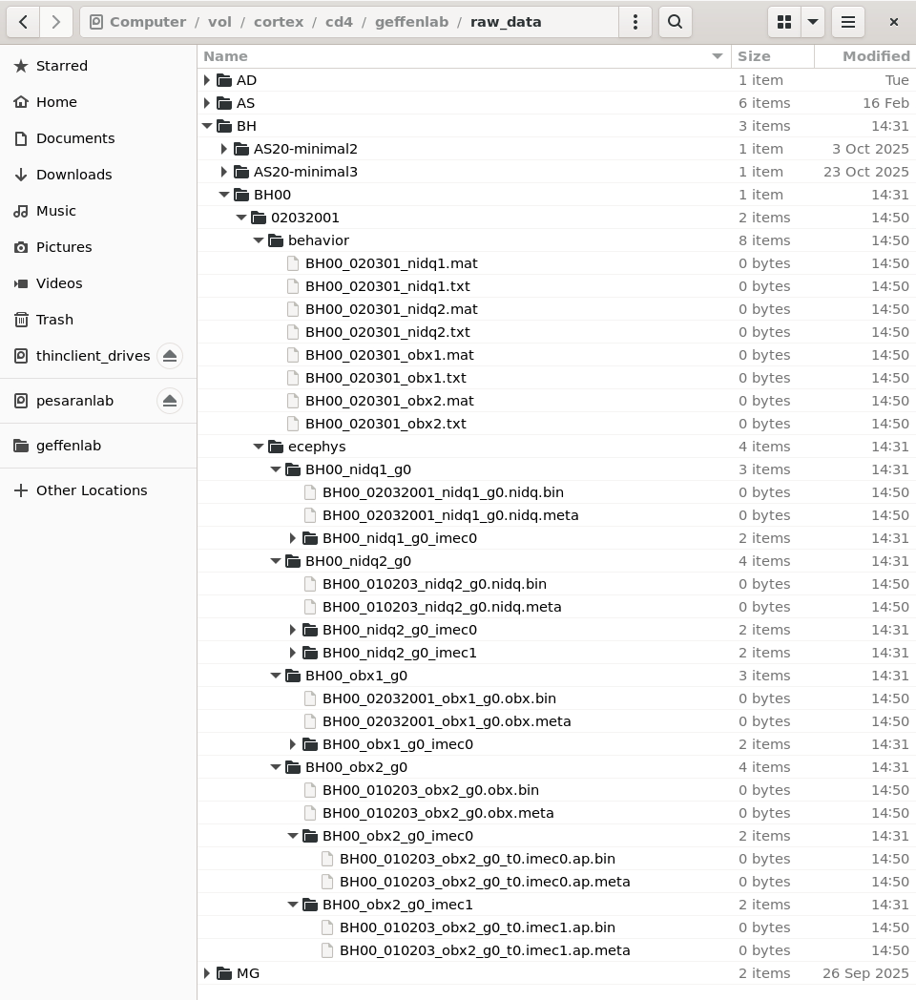

# Cortex Upload Data

This doc should help you upload session data from a local lab machine to cortex.

First, you'll need to do the one-time [cortex user setup](./cortex-user-setup.md) for your cortex user account and local lab machine.

## Upload data to cortex

This repo has a Python script [upload_data.py](../scripts/upload_data.py) that should help uploading data from your local lab machine to cortex.  Internally this uses `ssh` to connect to cortex using your own user credentials.

Run this script from the WSL environment of your local lab machine:

```
# Go to the directory that contains your data.
# For example:
cd /mnt/c/Users/labuser/Desktop/Data/
conda activate geffen-pipelines

# Run the data upload Python script.
python ~/geffenlab-ephys-pipeline/scripts/upload_data.py
```

This will prompt you for the experimenter initials, subject id, and session date(s) that you want to upload.  You can optionally specify a qualifier to further narrow down which files are uploaded.  For example:

```
$ python ~/geffenlab-ephys-pipeline/scripts/upload_data.py

2026-03-12 14:49:58,075 [INFO] Uploading behavior files from: /mnt/c/Users/labuser/Desktop/Data
2026-03-12 14:49:58,075 [INFO] Using behavior .txt pattern: <SUBJECT>/**/*_<MM><DD><YY>_*.txt
2026-03-12 14:49:58,075 [INFO] Using behavior .mat pattern: <SUBJECT>/**/*_<MM><DD><YY>_*.mat
2026-03-12 14:49:58,075 [INFO] Using behavior .hdf5 pattern: <SUBJECT>/**/*_<YYYY><MM><DD>_*.hdf5
2026-03-12 14:49:58,075 [INFO] Uploading ephys files from: /mnt/c/Users/labuser/Desktop/Data
2026-03-12 14:49:58,075 [INFO] Using SpikeGLX matching pattern(s): ['<SUBJECT>/**/*_<MM><DD><YYYY>_*.nidq.meta', '<SUBJECT>/**/*_<MM><DD><YYYY>_*.obx.bin', '<SUBJECT>/**/*_<YY><MM><DD>_*.nidq.meta', '<SUBJECT>/**/*_<YY><MM><DD>_*.obx.bin']
2026-03-12 14:49:58,075 [INFO] Using Open Ephys .oebin matching pattern: <SUBJECT>/**/<YYYY>-<MM>-<DD>_*/*/*/*/structure.oebin
2026-03-12 14:49:58,075 [INFO] Uploading files to remote host: 128.91.19.199
2026-03-12 14:49:58,075 [INFO] Uploading files to remote raw data root: /vol/cortex/cd4/geffenlab/raw_data
Experimenter initials: BH
2026-03-12 14:49:59,580 [INFO] Uploading files for experimenter: BH
Subject ID: BH00
2026-03-12 14:50:01,676 [INFO] Uploading files for subject id: BH00
Session date MMDDYYYY (multiple dates may be separated by spaces): 02032001
2026-03-12 14:50:05,133 [INFO] Uploading files for session date(s): ['2001-02-03']
Qualifier like 'training','ap.bin', 'recording1', etc.  Leave blank to upload all:
2026-03-12 14:50:05,992 [INFO] Uploading all files.
Remote username: ben
```

Based on the subject id, session date(s), and optional qualifier, the script will search local directories for behavior and ecephys files.  It will use [glob](https://docs.python.org/3/library/glob.html) patterns to select specific files of interest.  The defaults are intended to match:
 - behavior `.mat`, `.txt` and/or `.hdf5` files
 - SpikeGlx `nidq.meta` or `obx.bin` files, and their containing run directories
 - OpenEphys `.oebin` files, and their containing session directories

These patterns may match multiple behavior and ecephys sessions, for the same experimenter, subject, and date.
In this example, the subject `BH00` had multiple behavior and ephys matcheso on the same date, with session names `nidq1`, `nidq2`, `obx1`, and `obx2`.
These are test sessions, set up to test different matching patterns for SpikeGlx NIDQ vs OneBox, and different date patterns.

```
2026-03-12 14:50:07,663 [INFO] Uploading files as remote user: ben
2026-03-12 14:50:07,663 [INFO] Looking for session date: 2001-02-03 AKA 02032001
2026-03-12 14:50:07,663 [INFO] Searching local behavior_root for .txt like: BH00/**/*_020301_*.txt
2026-03-12 14:50:07,670 [INFO]   BH00/02032001/BH00_020301_nidq1.txt
2026-03-12 14:50:07,670 [INFO]   BH00/02032001/BH00_020301_nidq2.txt
2026-03-12 14:50:07,670 [INFO]   BH00/02032001/BH00_020301_obx1.txt
2026-03-12 14:50:07,670 [INFO]   BH00/02032001/BH00_020301_obx2.txt
2026-03-12 14:50:07,719 [INFO] Searching local behavior_root for .mat like: BH00/**/*_020301_*.mat
2026-03-12 14:50:07,723 [INFO]   BH00/02032001/BH00_020301_nidq1.mat
2026-03-12 14:50:07,723 [INFO]   BH00/02032001/BH00_020301_nidq2.mat
2026-03-12 14:50:07,723 [INFO]   BH00/02032001/BH00_020301_obx1.mat
2026-03-12 14:50:07,723 [INFO]   BH00/02032001/BH00_020301_obx2.mat
2026-03-12 14:50:07,768 [INFO] Searching local behavior_root for .hdf5 like: BH00/**/*_20010203_*.hdf5
2026-03-12 14:50:07,817 [INFO] Searching local ephys_root for SpikeGlx files like: BH00/**/*_02032001_*.nidq.meta
2026-03-12 14:50:07,866 [INFO] Found 1 SpikeGlx matches: [PosixPath('/mnt/c/Users/labuser/Desktop/Data/BH00/02032001/BH00_nidq1_g0/BH00_02032001_nidq1_g0.nidq.meta')]
2026-03-12 14:50:07,866 [INFO] Found spikeglx run dir: /mnt/c/Users/labuser/Desktop/Data/BH00/02032001/BH00_nidq1_g0
2026-03-12 14:50:07,870 [INFO]   BH00/02032001/BH00_nidq1_g0/BH00_02032001_nidq1_g0.nidq.bin
2026-03-12 14:50:07,870 [INFO]   BH00/02032001/BH00_nidq1_g0/BH00_02032001_nidq1_g0.nidq.meta
2026-03-12 14:50:07,870 [INFO]   BH00/02032001/BH00_nidq1_g0/BH00_nidq1_g0_imec0/BH00_02032001_nidq1_g0_t0.imec0.ap.bin
2026-03-12 14:50:07,870 [INFO]   BH00/02032001/BH00_nidq1_g0/BH00_nidq1_g0_imec0/BH00_02032001_nidq1_g0_t0.imec0.ap.meta
2026-03-12 14:50:07,870 [INFO] Searching local ephys_root for SpikeGlx files like: BH00/**/*_02032001_*.obx.bin
2026-03-12 14:50:07,920 [INFO] Found 1 SpikeGlx matches: [PosixPath('/mnt/c/Users/labuser/Desktop/Data/BH00/02032001/BH00_obx1_g0/BH00_02032001_obx1_g0.obx.bin')]
2026-03-12 14:50:07,920 [INFO] Found spikeglx run dir: /mnt/c/Users/labuser/Desktop/Data/BH00/02032001/BH00_obx1_g0
2026-03-12 14:50:07,924 [INFO]   BH00/02032001/BH00_obx1_g0/BH00_02032001_obx1_g0.obx.bin
2026-03-12 14:50:07,924 [INFO]   BH00/02032001/BH00_obx1_g0/BH00_02032001_obx1_g0.obx.meta
2026-03-12 14:50:07,924 [INFO]   BH00/02032001/BH00_obx1_g0/BH00_obx1_g0_imec0/BH00_02032001_obx1_g0_t0.imec0.ap.bin
2026-03-12 14:50:07,924 [INFO]   BH00/02032001/BH00_obx1_g0/BH00_obx1_g0_imec0/BH00_02032001_obx1_g0_t0.imec0.ap.meta
2026-03-12 14:50:07,924 [INFO] Searching local ephys_root for SpikeGlx files like: BH00/**/*_010203_*.nidq.meta
2026-03-12 14:50:07,974 [INFO] Found 1 SpikeGlx matches: [PosixPath('/mnt/c/Users/labuser/Desktop/Data/BH00/02032001/BH00_nidq2_g0/BH00_010203_nidq2_g0.nidq.meta')]
2026-03-12 14:50:07,975 [INFO] Found spikeglx run dir: /mnt/c/Users/labuser/Desktop/Data/BH00/02032001/BH00_nidq2_g0
2026-03-12 14:50:07,980 [INFO]   BH00/02032001/BH00_nidq2_g0/BH00_010203_nidq2_g0.nidq.bin
2026-03-12 14:50:07,980 [INFO]   BH00/02032001/BH00_nidq2_g0/BH00_010203_nidq2_g0.nidq.meta
2026-03-12 14:50:07,980 [INFO]   BH00/02032001/BH00_nidq2_g0/BH00_nidq2_g0_imec0/BH00_010203_nidq2_g0_t0.imec0.ap.bin
2026-03-12 14:50:07,981 [INFO]   BH00/02032001/BH00_nidq2_g0/BH00_nidq2_g0_imec0/BH00_010203_nidq2_g0_t0.imec0.ap.meta
2026-03-12 14:50:07,981 [INFO]   BH00/02032001/BH00_nidq2_g0/BH00_nidq2_g0_imec1/BH00_010203_nidq2_g0_t0.imec1.ap.bin
2026-03-12 14:50:07,981 [INFO]   BH00/02032001/BH00_nidq2_g0/BH00_nidq2_g0_imec1/BH00_010203_nidq2_g0_t0.imec1.ap.meta
2026-03-12 14:50:07,981 [INFO] Searching local ephys_root for SpikeGlx files like: BH00/**/*_010203_*.obx.bin
2026-03-12 14:50:08,030 [INFO] Found 1 SpikeGlx matches: [PosixPath('/mnt/c/Users/labuser/Desktop/Data/BH00/02032001/BH00_obx2_g0/BH00_010203_obx2_g0.obx.bin')]
2026-03-12 14:50:08,031 [INFO] Found spikeglx run dir: /mnt/c/Users/labuser/Desktop/Data/BH00/02032001/BH00_obx2_g0
2026-03-12 14:50:08,037 [INFO]   BH00/02032001/BH00_obx2_g0/BH00_010203_obx2_g0.obx.bin
2026-03-12 14:50:08,037 [INFO]   BH00/02032001/BH00_obx2_g0/BH00_010203_obx2_g0.obx.meta
2026-03-12 14:50:08,037 [INFO]   BH00/02032001/BH00_obx2_g0/BH00_obx2_g0_imec0/BH00_010203_obx2_g0_t0.imec0.ap.bin
2026-03-12 14:50:08,037 [INFO]   BH00/02032001/BH00_obx2_g0/BH00_obx2_g0_imec0/BH00_010203_obx2_g0_t0.imec0.ap.meta
2026-03-12 14:50:08,037 [INFO]   BH00/02032001/BH00_obx2_g0/BH00_obx2_g0_imec1/BH00_010203_obx2_g0_t0.imec1.ap.bin
2026-03-12 14:50:08,037 [INFO]   BH00/02032001/BH00_obx2_g0/BH00_obx2_g0_imec1/BH00_010203_obx2_g0_t0.imec1.ap.meta
2026-03-12 14:50:08,037 [INFO] Searching local ephys_root for .oebin like: BH00/**/2001-02-03_*/*/*/*/structure.oebin
2026-03-12 14:50:08,085 [INFO] Found 0 .oebin matches: []
2026-03-12 14:50:08,085 [INFO] Found 0 run dirs: set()
```

From all the files found, the script can use the optional qualifier to further restrict which files will be uploaded.  When the qualifier is provided, only files that contain the qualifier in their name will be uploaded.  For example, the qualifier "training" could be used to select "training" files but ignore "testing" files.

Before uploading, the script will show which files it plans to create on cortex and prompt for your confirmation.

```
2026-03-12 14:50:08,085 [INFO] Planning to create 28 files in remote dir /vol/cortex/cd4/geffenlab/raw_data:
2026-03-12 14:50:08,085 [INFO]   BH/BH00/02032001/behavior/BH00_020301_nidq1.txt
2026-03-12 14:50:08,085 [INFO]   BH/BH00/02032001/behavior/BH00_020301_nidq2.txt
2026-03-12 14:50:08,085 [INFO]   BH/BH00/02032001/behavior/BH00_020301_obx1.txt
2026-03-12 14:50:08,086 [INFO]   BH/BH00/02032001/behavior/BH00_020301_obx2.txt
2026-03-12 14:50:08,086 [INFO]   BH/BH00/02032001/behavior/BH00_020301_nidq1.mat
2026-03-12 14:50:08,086 [INFO]   BH/BH00/02032001/behavior/BH00_020301_nidq2.mat
2026-03-12 14:50:08,086 [INFO]   BH/BH00/02032001/behavior/BH00_020301_obx1.mat
2026-03-12 14:50:08,086 [INFO]   BH/BH00/02032001/behavior/BH00_020301_obx2.mat
2026-03-12 14:50:08,086 [INFO]   BH/BH00/02032001/ecephys/BH00_nidq1_g0/BH00_02032001_nidq1_g0.nidq.bin
2026-03-12 14:50:08,086 [INFO]   BH/BH00/02032001/ecephys/BH00_nidq1_g0/BH00_02032001_nidq1_g0.nidq.meta
2026-03-12 14:50:08,086 [INFO]   BH/BH00/02032001/ecephys/BH00_nidq1_g0/BH00_nidq1_g0_imec0/BH00_02032001_nidq1_g0_t0.imec0.ap.bin
2026-03-12 14:50:08,086 [INFO]   BH/BH00/02032001/ecephys/BH00_nidq1_g0/BH00_nidq1_g0_imec0/BH00_02032001_nidq1_g0_t0.imec0.ap.meta
2026-03-12 14:50:08,086 [INFO]   BH/BH00/02032001/ecephys/BH00_obx1_g0/BH00_02032001_obx1_g0.obx.bin
2026-03-12 14:50:08,086 [INFO]   BH/BH00/02032001/ecephys/BH00_obx1_g0/BH00_02032001_obx1_g0.obx.meta
2026-03-12 14:50:08,086 [INFO]   BH/BH00/02032001/ecephys/BH00_obx1_g0/BH00_obx1_g0_imec0/BH00_02032001_obx1_g0_t0.imec0.ap.bin
2026-03-12 14:50:08,086 [INFO]   BH/BH00/02032001/ecephys/BH00_obx1_g0/BH00_obx1_g0_imec0/BH00_02032001_obx1_g0_t0.imec0.ap.meta
2026-03-12 14:50:08,086 [INFO]   BH/BH00/02032001/ecephys/BH00_nidq2_g0/BH00_010203_nidq2_g0.nidq.bin
2026-03-12 14:50:08,086 [INFO]   BH/BH00/02032001/ecephys/BH00_nidq2_g0/BH00_010203_nidq2_g0.nidq.meta
2026-03-12 14:50:08,086 [INFO]   BH/BH00/02032001/ecephys/BH00_nidq2_g0/BH00_nidq2_g0_imec0/BH00_010203_nidq2_g0_t0.imec0.ap.bin
2026-03-12 14:50:08,086 [INFO]   BH/BH00/02032001/ecephys/BH00_nidq2_g0/BH00_nidq2_g0_imec0/BH00_010203_nidq2_g0_t0.imec0.ap.meta
2026-03-12 14:50:08,086 [INFO]   BH/BH00/02032001/ecephys/BH00_nidq2_g0/BH00_nidq2_g0_imec1/BH00_010203_nidq2_g0_t0.imec1.ap.bin
2026-03-12 14:50:08,086 [INFO]   BH/BH00/02032001/ecephys/BH00_nidq2_g0/BH00_nidq2_g0_imec1/BH00_010203_nidq2_g0_t0.imec1.ap.meta
2026-03-12 14:50:08,086 [INFO]   BH/BH00/02032001/ecephys/BH00_obx2_g0/BH00_010203_obx2_g0.obx.bin
2026-03-12 14:50:08,086 [INFO]   BH/BH00/02032001/ecephys/BH00_obx2_g0/BH00_010203_obx2_g0.obx.meta
2026-03-12 14:50:08,087 [INFO]   BH/BH00/02032001/ecephys/BH00_obx2_g0/BH00_obx2_g0_imec0/BH00_010203_obx2_g0_t0.imec0.ap.bin
2026-03-12 14:50:08,087 [INFO]   BH/BH00/02032001/ecephys/BH00_obx2_g0/BH00_obx2_g0_imec0/BH00_010203_obx2_g0_t0.imec0.ap.meta
2026-03-12 14:50:08,087 [INFO]   BH/BH00/02032001/ecephys/BH00_obx2_g0/BH00_obx2_g0_imec1/BH00_010203_obx2_g0_t0.imec1.ap.bin
2026-03-12 14:50:08,087 [INFO]   BH/BH00/02032001/ecephys/BH00_obx2_g0/BH00_obx2_g0_imec1/BH00_010203_obx2_g0_t0.imec1.ap.meta
Do you want to upload these 28 files?  Type 'yes' to proceed: yes
```

You must type `yes` to proceed.  Otherwise the script will exit before uploading.
If you do type `yes` the script will prompt for your cortex user password, then upload each file to cortex:

```
2026-03-12 14:50:09,689 [WARNING] Proceeding to upload files.
Password for remote user ben:
2026-03-12 14:50:14,674 [INFO] Connecting to remote host: 128.91.19.199.
2026-03-12 14:50:25,090 [INFO] Connected (version 2.0, client OpenSSH_8.9p1)
2026-03-12 14:50:25,210 [INFO] Authentication (password) successful!
2026-03-12 14:50:25,210 [INFO] Uploading to /vol/cortex/cd4/geffenlab/raw_data:
2026-03-12 14:50:25,210 [INFO]   BH/BH00/02032001/behavior/BH00_020301_nidq1.txt
2026-03-12 14:50:27,640 [INFO] [chan 1] Opened sftp connection (server version 3)
2026-03-12 14:50:27,654 [INFO]   BH/BH00/02032001/behavior/BH00_020301_nidq2.txt
2026-03-12 14:50:27,728 [INFO]   BH/BH00/02032001/behavior/BH00_020301_obx1.txt
2026-03-12 14:50:27,796 [INFO]   BH/BH00/02032001/behavior/BH00_020301_obx2.txt
2026-03-12 14:50:27,863 [INFO]   BH/BH00/02032001/behavior/BH00_020301_nidq1.mat
2026-03-12 14:50:27,937 [INFO]   BH/BH00/02032001/behavior/BH00_020301_nidq2.mat
2026-03-12 14:50:28,007 [INFO]   BH/BH00/02032001/behavior/BH00_020301_obx1.mat
2026-03-12 14:50:28,074 [INFO]   BH/BH00/02032001/behavior/BH00_020301_obx2.mat
2026-03-12 14:50:28,137 [INFO]   BH/BH00/02032001/ecephys/BH00_nidq1_g0/BH00_02032001_nidq1_g0.nidq.bin
2026-03-12 14:50:28,203 [INFO]   BH/BH00/02032001/ecephys/BH00_nidq1_g0/BH00_02032001_nidq1_g0.nidq.meta
2026-03-12 14:50:28,270 [INFO]   BH/BH00/02032001/ecephys/BH00_nidq1_g0/BH00_nidq1_g0_imec0/BH00_02032001_nidq1_g0_t0.imec0.ap.bin
2026-03-12 14:50:28,362 [INFO]   BH/BH00/02032001/ecephys/BH00_nidq1_g0/BH00_nidq1_g0_imec0/BH00_02032001_nidq1_g0_t0.imec0.ap.meta
2026-03-12 14:50:28,430 [INFO]   BH/BH00/02032001/ecephys/BH00_obx1_g0/BH00_02032001_obx1_g0.obx.bin
2026-03-12 14:50:28,505 [INFO]   BH/BH00/02032001/ecephys/BH00_obx1_g0/BH00_02032001_obx1_g0.obx.meta
2026-03-12 14:50:28,579 [INFO]   BH/BH00/02032001/ecephys/BH00_obx1_g0/BH00_obx1_g0_imec0/BH00_02032001_obx1_g0_t0.imec0.ap.bin
2026-03-12 14:50:28,661 [INFO]   BH/BH00/02032001/ecephys/BH00_obx1_g0/BH00_obx1_g0_imec0/BH00_02032001_obx1_g0_t0.imec0.ap.meta
2026-03-12 14:50:28,728 [INFO]   BH/BH00/02032001/ecephys/BH00_nidq2_g0/BH00_010203_nidq2_g0.nidq.bin
2026-03-12 14:50:28,797 [INFO]   BH/BH00/02032001/ecephys/BH00_nidq2_g0/BH00_010203_nidq2_g0.nidq.meta
2026-03-12 14:50:28,874 [INFO]   BH/BH00/02032001/ecephys/BH00_nidq2_g0/BH00_nidq2_g0_imec0/BH00_010203_nidq2_g0_t0.imec0.ap.bin
2026-03-12 14:50:28,957 [INFO]   BH/BH00/02032001/ecephys/BH00_nidq2_g0/BH00_nidq2_g0_imec0/BH00_010203_nidq2_g0_t0.imec0.ap.meta
2026-03-12 14:50:29,025 [INFO]   BH/BH00/02032001/ecephys/BH00_nidq2_g0/BH00_nidq2_g0_imec1/BH00_010203_nidq2_g0_t0.imec1.ap.bin
2026-03-12 14:50:29,098 [INFO]   BH/BH00/02032001/ecephys/BH00_nidq2_g0/BH00_nidq2_g0_imec1/BH00_010203_nidq2_g0_t0.imec1.ap.meta
2026-03-12 14:50:29,173 [INFO]   BH/BH00/02032001/ecephys/BH00_obx2_g0/BH00_010203_obx2_g0.obx.bin
2026-03-12 14:50:29,242 [INFO]   BH/BH00/02032001/ecephys/BH00_obx2_g0/BH00_010203_obx2_g0.obx.meta
2026-03-12 14:50:29,322 [INFO]   BH/BH00/02032001/ecephys/BH00_obx2_g0/BH00_obx2_g0_imec0/BH00_010203_obx2_g0_t0.imec0.ap.bin
2026-03-12 14:50:29,393 [INFO]   BH/BH00/02032001/ecephys/BH00_obx2_g0/BH00_obx2_g0_imec0/BH00_010203_obx2_g0_t0.imec0.ap.meta
2026-03-12 14:50:29,464 [INFO]   BH/BH00/02032001/ecephys/BH00_obx2_g0/BH00_obx2_g0_imec1/BH00_010203_obx2_g0_t0.imec1.ap.bin
2026-03-12 14:50:29,535 [INFO]   BH/BH00/02032001/ecephys/BH00_obx2_g0/BH00_obx2_g0_imec1/BH00_010203_obx2_g0_t0.imec1.ap.meta
2026-03-12 14:50:29,611 [INFO] Setting 'group' and 'other' permissions for session dir /vol/cortex/cd4/geffenlab/raw_data/BH/BH00/02032001:
2026-03-12 14:50:29,754 [INFO] [chan 1] sftp session closed.
2026-03-12 14:50:29,755 [INFO] OK.
```

## Results overview

All the matching behavior and ephys files are now uploaded from the original rit to cortex.

The original rig data look like this:



The data uploaded to cortex look like this, in `/vol/cortex/cd4/geffenalb/raw_data/BH/BH00/02032001/`:




## Options

The example above used several default options like the cortex host address, the local directories to search for behavior and spikeglx files, and the lab's assigned data directory on cortex.
All of these can be modified from the command line as needed.

You can also specify many values like `--experimenter`, `--subject`, `--date`, and `--qualifier` on the command line instead of waiting for the script to prompt you interactively.  The only argument you can not specify on the command line is your cortex user password -- this is to prevent your password from being saved into your terminal command history.

For details of command line options please see:

```
python ~/geffenlab-ephys-pipeline/scripts/upload_data.py --help
```

## Uploading multiple dates at once

For the `--date` command line option, or when prompted interactively for session dates, you can provide one or more session dates separated by spaces for the script to search and upload.

For example:

```
python ~/geffenlab-ephys-pipeline/scripts/upload_data.py --date 03112025 03122025 03132025
```

```
Session date MMDDYYYY (multiple dates may be separated by spaces): 03112025 03122025 03132025
```

## Pattern matching for finding local files to upload

The script uses pattern matching to locate files to upload.  By default it will look for behavior files that end with `.txt` and `.mat`.  It will look for SpikeGlx run directories that contains files ending with `.nidq.meta` or `.obx.bin`, and with dates like `MMDDYYYY` or `YYMMDD`.

You can supply alternative patterns on the command line.  Here are the relevant parameters and their default values:

| parameter | default value | notes |
|---|---|---|
| `--behavior-root` | `.` (current directory) | searches within for behavior pattern matches |
| `--behavior-txt-pattern` | `<SUBJECT>/**/*_<MM><DD><YY>_*.txt` | upload all matches |
| `--behavior-mat-pattern` | `<SUBJECT>/**/*_<MM><DD><YY>_*.mat` | upload all matches |
| `--behavior-hdf5-pattern` | `<SUBJECT>/**/*_<YYYY><MM><DD>_*.hdf5` | upload all matches |
| `--ephys-root` | `.` (current directory) | searches within for SpikeGlx or OpenEphys pattern matches |
| `--spikeglx-run-patterns` | `<SUBJECT>/**/*_<MM><DD><YYYY>_*.nidq.meta` `<SUBJECT>/**/*_<MM><DD><YYYY>_*.obx.bin` `<SUBJECT>/**/*_<YY><MM><DD>_*.nidq.meta` `<SUBJECT>/**/*_<YY><MM><DD>_*.obx.bin` | upload SpikeGlx run dirs that contains matching files |
| `--openephys-oebin-pattern` | `<SUBJECT>/**/<YYYY>-<MM>-<DD>_*/*/*/*/structure.oebin` | upload OpenEphys session dirs that are four levels above mathcing files |

Each of these matching patterns supports wildcards and replacements for flexibility:
 - `?`: match any single character
 - `*`: match zero or more characters, or any single subdirectory
 - `**`: match zero or more subdirectories
 - `<EXPERIMENTER>`: replaced with the given `--experimenter` (or experimenter entered at prompt)
 - `<SUBJECT>`: replaced with the given `--subject` (or subject entered at prompt)
 - `<YYYY>`: replaced with the four-digit year part of the given `--date` (or date entered at prompt)
 - `<YY>`: replaced with the two-digit year part of the given `--date` (or date entered at prompt)
 - `<MM>`: replaced with the two-digit month part of the given `--date` (or date entered at prompt)
 - `<DD>`: replaced with the two-digit day part of the given `--date` (or date entered at prompt)


Here's an example that would match SpikeGlx OneBox run dirs using a custom date pattern `YYYY-MM-DD`:

```
cd /mnt/c/Users/labuser/Desktop/Data/
conda activate geffen-pipelines

python ~/geffenlab-ephys-pipeline/scripts/upload_data.py --spikeglx-run-patterns '<SUBJECT>/**/*_<YYYY>-<MM>-<DD>_*.obx.bin'
```
